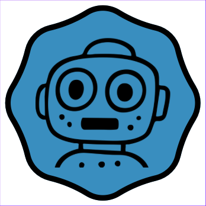
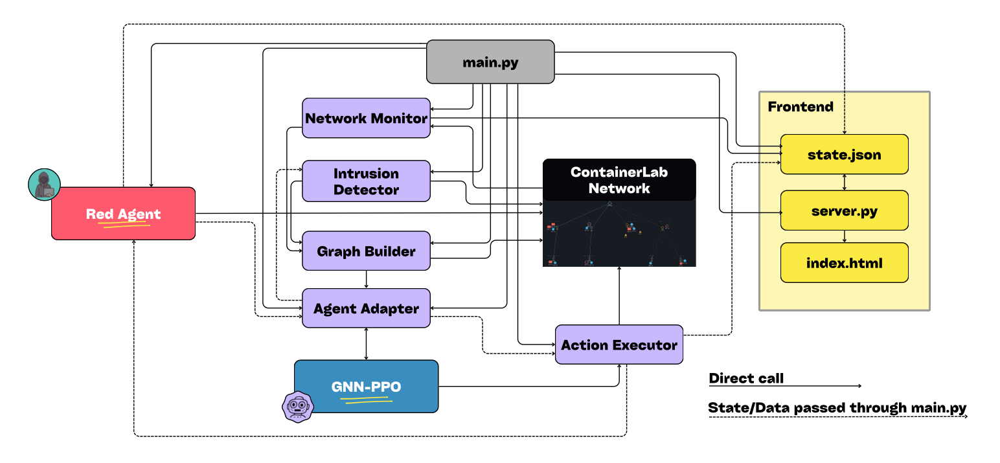
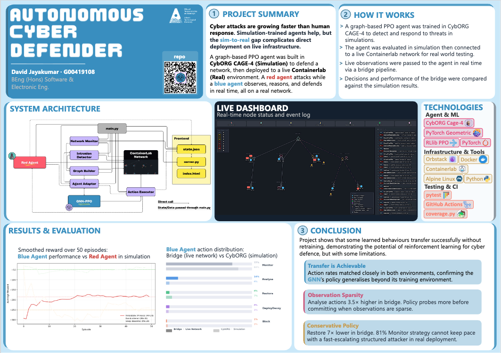

# FYP Phase 2: Network Defender 

## Demo Video 🎥

[Watch on YouTube](#) *(link to be added)*

---

## Project Overview 📋

This repository is Phase 2 of my Final Year Project — a **live network defence system** that deploys a trained GNN-PPO reinforcement learning agent against a real containerlab network topology. Phase 1 (learning RL fundamentals on CartPole and FrozenLake) lives in a [separate repo](https://github.com/DavidJ7705/Learning_RL_FYP).

The GNN-PPO agent is based on the [Cybermonic CAGE-4 submission](https://github.com/cybermonic/cage-4-submission) and was trained inside [CybORG CAGE4](https://github.com/cage-challenge/cage-challenge-4), a cybersecurity multi-agent simulation environment developed by DSTL. Phase 2 bridges the gap between simulation and reality: the same trained weights are loaded and run against a live Docker network, with a real red agent attacking and a real blue agent defending — step by step, in real time.

### What Happens at Runtime

1. A **red agent** (finite state machine attacker) executes real Docker operations against containerised hosts — scanning ports, planting compromise markers, escalating privileges, and causing impact
2. An **intrusion detector** scans running containers for compromise signals and enriches the observation
3. A **graph builder** encodes the live network state as a 192-dimensional PyTorch Geometric graph, matching the trained agent's expected input exactly
4. The **GNN-PPO agent** runs a forward pass on the graph and selects a defensive action (0–80)
5. An **action executor** translates the action integer into a real Docker/containerlab operation — blocking hosts, deploying decoys, restoring containers, or reconfiguring subnet routes
6. A **live D3.js dashboard** streams the episode state over HTTP, showing node compromise, FSM transitions, and blue agent decisions in real time

---

## Architecture 🏗️



```
Red Agent (bridge/red_agent.py)
    ↓ exec_run attacks on containers
Containerlab Network (containerlab-networks/cage4-topology.yaml)
    ↓ observed by
ContainerlabMonitor (bridge/network_monitor.py)
    ↓ enriched by
IntrusionDetector (bridge/intrusion_detector.py)
    ↓ graph built by
ObservationGraphBuilder (bridge/graph_builder.py)
    ↓ fed into
AgentAdapter (bridge/agent_adapter.py)  ←  trained weights (trained-agent/weights/)
    ↓ action integer (0–80)
ActionExecutor (bridge/action_executor.py)
    ↓ exec_run / network disconnect / ip route / containerlab deploy
Containerlab Network
    ↓ state.json written each step
HTTP Server (bridge/server.py)
    ↓ /api/state polled every 1.5s
Live Dashboard (frontend/index.html)
```

### Network Topology

The bridge uses a **simplified 25-node topology** across 9 subnets. The actual CybORG CAGE4 simulation has ~84 hosts — this is a deliberate reduction to enable rapid prototyping on a local machine. The GNN-PPO policy generalises across topology sizes by design (it operates on graph structure, not fixed-size inputs), and the simplification was validated: the agent's defensive behaviour transferred correctly.

| Zone | Hosts |
|------|-------|
| admin | 1 server, 1 user |
| contractor | 1 server, 1 user |
| internet | 1 router |
| office | 1 server, 1 user |
| operational-a | 1 server, 1 user |
| operational-b | 1 server, 1 user |
| public-access | 1 server, 1 user |
| restricted-a | 1 server, 1 user |
| restricted-b | 1 server, 1 user |

---

## Two Main Components

### `trained-agent/` — GNN-PPO Agent (already trained)

The agent architecture comes from the [Cybermonic CAGE-4 submission](https://github.com/cybermonic/cage-4-submission). It uses PPO with a Graph Neural Network policy trained on the CybORG CAGE4 environment. It observes the network as a graph and selects one of 81 actions at each step.

- **Model**: `trained-agent/models/cage4.py` — GNN-PPO architecture
- **Weights**: `trained-agent/weights/gnn_ppo-{0..4}.pt` — 5 checkpoints
- **Training**: `trained-agent/train.py`
- **Evaluation**: `trained-agent/evaluation.py` — runs 100-step episodes inside CybORG
- **Comparison**: `trained-agent/compare.py` — compares CybORG vs bridge action distributions

### `bridge/` — Live Deployment Layer

Connects the trained agent to a real containerlab network. All bridge components run inside the OrbStack Linux VM.

| File | Role |
|------|------|
| `bridge/main.py` | Orchestration loop — red attacks, blue defends, state written each step |
| `bridge/network_monitor.py` | Discovers and classifies all running containerlab containers |
| `bridge/graph_builder.py` | Builds 192-dim PyTorch Geometric graph from live network state |
| `bridge/agent_adapter.py` | Loads trained weights, runs forward pass, returns action integer |
| `bridge/action_executor.py` | Translates action integer to Docker/containerlab operations |
| `bridge/red_agent.py` | FSM attacker — 9 actions mapped to real Docker exec_run calls |
| `bridge/intrusion_detector.py` | Scans containers for `/tmp/.compromised` and `/root/.compromised` markers |
| `bridge/server.py` | stdlib HTTP server — serves dashboard + `/api/state` |
| `bridge/evaluation.py` | Automated 100-step run with CSV logging |

---

## Action Space

```
Node actions (0–63):   action_type = action // 16,  host_idx = action % 16
  0 = Analyse          — ps aux on target container
  1 = Remove/Block     — Docker network disconnect
  2 = Restore          — container restart + reconnect
  3 = DeployDecoy      — spawn nginx:alpine decoy via containerlab YAML

Edge actions (64–79):  AllowTrafficZone (64–71) / BlockTrafficZone (72–79)
                       — ip route blackhole <cidr> on subnet gateway

Global action (80):    Monitor — no-op
```

---

## Technologies Used 🛠️

| Technology | Purpose |
|-----------|---------|
| PyTorch + PyTorch Geometric | GNN-PPO model inference |
| CybORG CAGE4 | Training environment and FSM reference implementation |
| Containerlab | Declarative network topology deployment |
| Docker SDK for Python | Container exec, network operations, state inspection |
| D3.js v7 | Force-directed live dashboard |
| OrbStack | Linux VM host for containerlab and Docker |
| GitHub Actions | CI — pytest + coverage on Docker Compose topology |

---

## Setup Instructions 🔧

### Prerequisites

- **macOS** — [OrbStack](https://orbstack.dev/) installed, with a Linux machine created inside it
- **Inside the OrbStack Linux VM** — [Containerlab](https://containerlab.dev/) and Python 3.10+
- Docker is provided automatically by OrbStack — no separate install needed

> All `bridge/` commands must be run **inside the OrbStack Linux VM terminal**, not your macOS terminal. OrbStack port-forwards `localhost:8080` to macOS automatically, so you open the dashboard in your normal macOS browser.

### Step 1 — Clone the repo

> **macOS terminal** (or the OrbStack Linux VM terminal if the repo is already on your Mac filesystem at `/mnt/mac/...`):

```bash
git clone https://github.com/DavidJ7705/Network_Defender_FYP.git
```

### Step 2 — Create the native Linux venv

> **OrbStack Linux VM terminal:**

```bash
python3 -m venv ~/fyp-venv-linux
~/fyp-venv-linux/bin/pip install torch==2.6.0+cpu --index-url https://download.pytorch.org/whl/cpu
~/fyp-venv-linux/bin/pip install torch_geometric docker
```

> Note: the venv must be created natively inside the Linux VM (not on the macOS-mounted path). PyTorch `.so` files read from the macOS filesystem via OrbStack are very slow.

### Step 3 — Install trained-agent dependencies (CybORG evaluation only)

> **OrbStack Linux VM terminal:**

```bash
cd trained-agent
bash setup.sh
```

---

## Setup on Windows (WSL) 🪟

If you're on a Windows machine you can run the bridge inside WSL (Windows Subsystem for Linux) instead of OrbStack.

### Step 1 — Install WSL and containerlab

> **Windows PowerShell (run as Administrator):**

```powershell
wsl --install
```

Restart when prompted, then open a **WSL terminal** for all remaining steps.

> **WSL terminal:**

```bash
bash -c "$(curl -sL https://get.containerlab.dev)"
```

### Step 2 — Install Docker inside WSL

> **WSL terminal:**

```bash
sudo apt update
sudo apt install -y docker.io
sudo systemctl start docker
sudo systemctl enable docker
```

### Step 3 — Deploy the containerlab topology

The repo lives on your Windows filesystem, accessible from WSL at `/mnt/c/...`:

> **WSL terminal:**

```bash
cd /mnt/c/Network_Defender_FYP
sudo containerlab deploy -t containerlab-networks/cage4-topology.yaml
```

### Step 4 — Create the Python venv

Create the venv in the Linux home directory (not on `/mnt/c/` — Windows-mounted paths are slow for binary reads):

> **WSL terminal:**

```bash
cd ~
sudo apt install python3.12-venv
python3 -m venv fyp-venv-linux
~/fyp-venv-linux/bin/pip install torch docker numpy torch-geometric
```

### Step 5 — Run the bridge

> **WSL terminal:**

```bash
cd /mnt/c/Network_Defender_FYP/bridge
sudo ~/fyp-venv-linux/bin/python main.py
```

Open `http://localhost:8080` in your Windows browser.

### To reopen WSL later

Open PowerShell and run:
```powershell
wsl
```

---

## How to Run the Live Dashboard ▶️

You need two terminal tabs open inside the **OrbStack Linux VM**, and your normal **macOS browser** to view the dashboard.

**OrbStack Linux VM — Terminal 1: deploy the containerlab topology**
```bash
cd ~/Desktop/Network_Defender_FYP/containerlab-networks
sudo containerlab deploy -t cage4-topology.yaml
```

**OrbStack Linux VM — Terminal 2: run the bridge episode**
```bash
cd ~/Desktop/Network_Defender_FYP/bridge
rm -rf __pycache__
sudo ~/fyp-venv-linux/bin/python main.py
```

The server prints: `[server] Dashboard → http://localhost:8080`

**macOS browser:** open `http://localhost:8080` — OrbStack automatically port-forwards from the Linux VM, no extra config needed.

The dashboard polls `/api/state` every 1.5 seconds. The connection indicator turns green when live data arrives and red if the server is unreachable.

**To stop:** `Ctrl+C` in Terminal 2 — triggers graceful shutdown (cleans up decoys + compromise flags).

### Teardown

**OrbStack Linux VM:**
```bash
cd ~/Desktop/Network_Defender_FYP/containerlab-networks
sudo containerlab destroy -t cage4-topology.yaml
```

---

## Running Tests 🧪

> **OrbStack Linux VM terminal**, from the repo root:

```bash
cd bridge
sudo ~/fyp-venv-linux/bin/python -m pytest tests/ -v
```

Coverage report:
```bash
sudo ~/fyp-venv-linux/bin/python -m coverage run -m pytest tests/
sudo ~/fyp-venv-linux/bin/python -m coverage report
```

### Test Suite

| Test file | Type | What it covers |
|-----------|------|----------------|
| `tests/test_monitor.py` | Unit | Container discovery and classification |
| `tests/test_graph_builder.py` | Unit | 192-dim feature vector encoding |
| `tests/test_agent_adapter.py` | Unit | Weight loading and action selection |
| `tests/test_action_executor.py` | Unit | Full action type coverage (0–80) |
| `tests/test_red_agent.py` | Unit | 20-step FSM run, all state transitions |
| `tests/test_intrusion_detector.py` | Unit | File marker detection at all 3 levels |
| `tests/test_pipeline.py` | Integration | monitor → graph → agent → executor chain |

CI runs automatically on every push via GitHub Actions (`.github/workflows/ci.yml`) using a Docker Compose topology — **15 passed, 4 skipped, 70% coverage**.

---

## Running CybORG Evaluation (trained-agent/)

> **OrbStack Linux VM terminal** (uses the trained-agent venv, not the bridge venv):

```bash
cd trained-agent
venv/bin/python evaluation.py
```

To compare CybORG simulation results vs bridge results:
```bash
venv/bin/python compare.py
```

---

## Project Structure 📁

```
Network_Defender_FYP/
│
├── .github/workflows/
│   └── ci.yml                        # GitHub Actions CI (pytest + coverage)
│
├── bridge/
│   ├── main.py                       # Orchestration loop
│   ├── network_monitor.py            # Container discovery
│   ├── graph_builder.py              # 192-dim graph encoder
│   ├── agent_adapter.py              # GNN-PPO inference
│   ├── action_executor.py            # Docker/containerlab action execution
│   ├── red_agent.py                  # FSM red agent
│   ├── intrusion_detector.py         # Compromise file marker scanner
│   ├── server.py                     # HTTP server (dashboard + /api/state)
│   ├── evaluation.py                 # Automated 100-step CSV logger
│   ├── results/                      # Evaluation CSVs (gitignored)
│   └── tests/
│       ├── conftest.py
│       ├── test_monitor.py
│       ├── test_graph_builder.py
│       ├── test_agent_adapter.py
│       ├── test_action_executor.py
│       ├── test_red_agent.py
│       ├── test_intrusion_detector.py
│       └── test_pipeline.py
│
├── containerlab-networks/
│   └── cage4-topology.yaml           # CAGE4 network topology definition
│
├── frontend/
│   ├── index.html                    # Live dashboard (polls /api/state)
│   └── dashboard_hardcoded.html      # Reference dashboard (self-contained JS simulation)
│
├── trained-agent/
│   ├── models/cage4.py               # GNN-PPO model definition
│   ├── weights/gnn_ppo-{0..4}.pt     # Trained model checkpoints
│   ├── wrapper/                      # CybORG observation graph wrappers
│   ├── train.py                      # Training script
│   ├── evaluation.py                 # CybORG evaluation
│   ├── evaluate_cyborg.py            # Extended evaluation with CSV logging
│   ├── compare.py                    # CybORG vs bridge comparison
│   ├── plot_bridge_analysis.py       # Bridge results visualisation
│   ├── plot_comparison.py            # Side-by-side comparison plots
│   └── results/                      # CybORG evaluation CSVs + plots
│
├── CAGE_CHALLENGE_4/                 # CybORG source (for training + evaluation)
│
├── assets/
│   ├── *.png                         # Screenshots and diagram images for README
│   └── report.pdf                    # Final project report
│
├── docker-compose.test.yml           # Docker Compose topology for CI
└── README.md
```

---

## Results 📊

Evaluation CSVs are logged to `bridge/results/` (gitignored). Each row records the step, red action, blue action, target host, and node compromise counts.

Visualisation scripts:
- `trained-agent/plot_bridge_analysis.py` — compromised count over time, blue action distribution, decoy count over time
- `trained-agent/plot_comparison.py` — side-by-side bridge vs CybORG action distribution

---

## Known Limitations

- **Edge actions (64–79):** containerlab's Alpine containers don't support `iptables`, so subnet firewall rules use `ip route blackhole` as an approximation
- **Red agent start state:** bridge red agent starts knowing all hosts (CybORG red starts knowing only the contractor subnet — a known simplification)
- **Simulation-only features:** CybORG encodes OS version, patch level, and file system metadata in the 192-dim feature vector — these are left as zero in the bridge since there is no real equivalent

---

## Project Poster 🗂️



---

## References 📚

- [Cybermonic CAGE-4 Submission](https://github.com/cybermonic/cage-4-submission) — GNN-PPO agent architecture this project is based on
- [CybORG CAGE4](https://github.com/cage-challenge/cage-challenge-4) — training environment and FiniteStateRedAgent FSM reference
- [Containerlab Documentation](https://containerlab.dev/)
- [PyTorch Geometric](https://pytorch-geometric.readthedocs.io/)
- [Docker SDK for Python](https://docker-py.readthedocs.io/)
- [D3.js](https://d3js.org/)

---

## Author 👤

**David Jayakumar**
Final Year Project 2024/2025

[](https://www.linkedin.com/in/david-jayakumar/) [](https://github.com/DavidJ7705)
